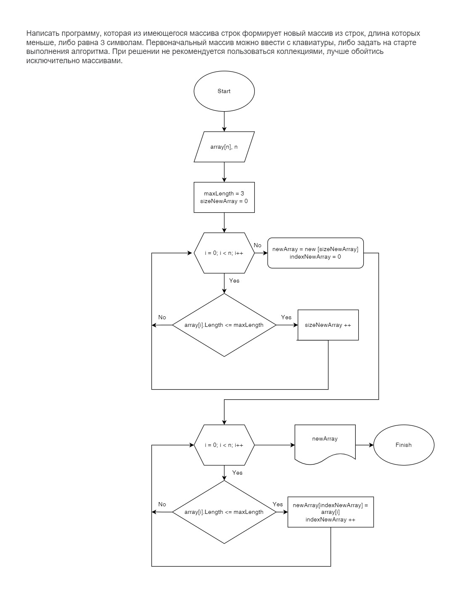

# Итоговая контрольная работа по основному блоку
## Урок 1. Контрольная работа
Данная работа необходима для проверки ваших знаний и навыков по итогу прохождения первого блока обучения на программе Разработчик. Мы должны убедится, что базовое знакомство с IT прошло успешно.

Задача алгоритмически не самая сложная, однако для полноценного выполнения проверочной работы необходимо:

1. Создать репозиторий на GitHub
2. Нарисовать блок-схему алгоритма (можно обойтись блок-схемой основной содержательной части, если вы выделяете её в отдельный метод)
3. Снабдить репозиторий оформленным текстовым описанием решения (файл README.md)
4. Написать программу, решающую поставленную задачу
5. Использовать контроль версий в работе над этим небольшим проектом (не должно быть так, что всё залито одним коммитом, как минимум этапы 2, 3, и 4 должны быть расположены в разных коммитах)

*Задача:* Написать программу, которая из имеющегося массива строк формирует новый массив из строк, длина которых меньше, либо равна 3 символам. Первоначальный массив можно ввести с клавиатуры, либо задать на старте выполнения алгоритма. При решении не рекомендуется пользоваться коллекциями, лучше обойтись исключительно массивами.

*Примеры:*
```
[“Hello”, “2”, “world”, “:-)”] → [“2”, “:-)”]
[“1234”, “1567”, “-2”, “computer science”] → [“-2”]
[“Russia”, “Denmark”, “Kazan”] → []
```

## Решение

1. Был создан репозиторий [the_developer_block.control_work](https://github.com/intenebris/the_developer_block.control_work), на странице которого вы сейчас и находитесь.
2. Была нарисована блок-схема, которая находится в корневом каталоге репозитория. Так же она представлена ниже в виде изображения.



3. Репозиторий снабжен текстовым описанием решения в файле **README.md**
4. Описание решения задачи.

```
void Main()
{
```
*На старте выполнения были заданы массивы. Для выбора одного из заданных массивов был использован метод switch.*
```
    System.Console.WriteLine("Выберите один из массивов:");
    Console.WriteLine("1 - [“Hello”, “2”, “world”, “:-)”] \n2 - [“1234”, “1567”, “-2”, “computer science”] \n3 - [“Russia”, “Denmark”, “Kazan”]");
    string[] array = new string[] { };
    string? inputArray = InputOption("Для выбора введите цифру, соответствующую номеру массива: ");
    switch (inputArray)
    {
        case "1":
            array = new string[] { "Hello", "2", "world", ":-)" };
            break;
        case "2":
            array = new string[] { "1234", "1567", "-2", "computer science" };
            break;
        case "3":
            array = new string[] { "Russia", "Denmark", "Kazan" };
            break;
        default:
            Console.WriteLine($"{inputArray} - Такого массива нет. Попробуйте еще раз.");
            break;
    }
    PrintNewArray(array, 3);


}
```
*Способ ввода данных с клавиатуры в консоле был выделен в отдельную функцию*
```
string? InputOption(string msg)
{
    System.Console.Write(msg);
    return Console.ReadLine();
}
```
*В первую очередь мы вычисляем размер нового массива, который будет сформирован из строк старого массива длина которых меньше, либо равна 3 символам.*
```
int FindSizeArray(string[] arr, int maxLength)
{
    int sizeNewArray = 0;
    for (int i = 0; i < arr.Length; i++)
    {
        if (arr[i].Length <= maxLength) sizeNewArray++;
    }
    return sizeNewArray;
}
```
*Далее, зная размер нового массива, создаем сам новый массив.*
```
string[] CreateNewArray(string[] arr, int maxLength)
{
    string[] tempArray = new string[FindSizeArray(arr, maxLength)];
    int indexNewArray = 0;
    for (int i = 0; i < arr.Length; i++)
    {
        if (arr[i].Length <= maxLength)
        {
            tempArray[indexNewArray] = arr[i];
            indexNewArray++;
        }
    }
    return tempArray;
}
```
*В завершении создаем функцию для вывода получившегося результата в консоль.*
```
void PrintNewArray(string[] arr, int maxLength)
{
    string[] resultArray = CreateNewArray(arr, maxLength);
    if (resultArray.Length == 0)
    {
        System.Console.WriteLine(" ");
    }
    else
        for (int i = 0; i < resultArray.Length; i++)
        {
            if (i == resultArray.Length - 1)
                Console.Write($"“{resultArray[i]}”\n");
            else
                Console.Write($"“{resultArray[i]}”, ");
        }
}

Main();
```

Пример отображения результата работы программы в консоли:
```
PS C:\gb-workshop\the_developer_block\Final_work> dotnet run
Выберите один из массивов:
1 - [“Hello”, “2”, “world”, “:-)”]
2 - [“1234”, “1567”, “-2”, “computer science”]
3 - [“Russia”, “Denmark”, “Kazan”]
Для выбора введите цифру, соответствующую номеру массива: 1
“2”, “:-)”
PS C:\gb-workshop\the_developer_block\Final_work> 
```

5. Весь проект загружен на GitHub в данный репозиторий. В ходе работы было создано множество коммитов по каждому этапу работы. 
```
PS C:\gb-workshop\the_developer_block> git log --oneline
9fed160 (HEAD -> master, origin/master) Added a solution of task
0a77915 Added a picture 0f the block-diagram
5aae106 Update Block-diagram.drawio
2c53635 Added Block-diagram.drawio
57604f3 Created the C# Project for final task
37fd136 Formatting some description in README.md
b25da43 Added a task to the README.md
b093d48 Git init and creating README.md
```
